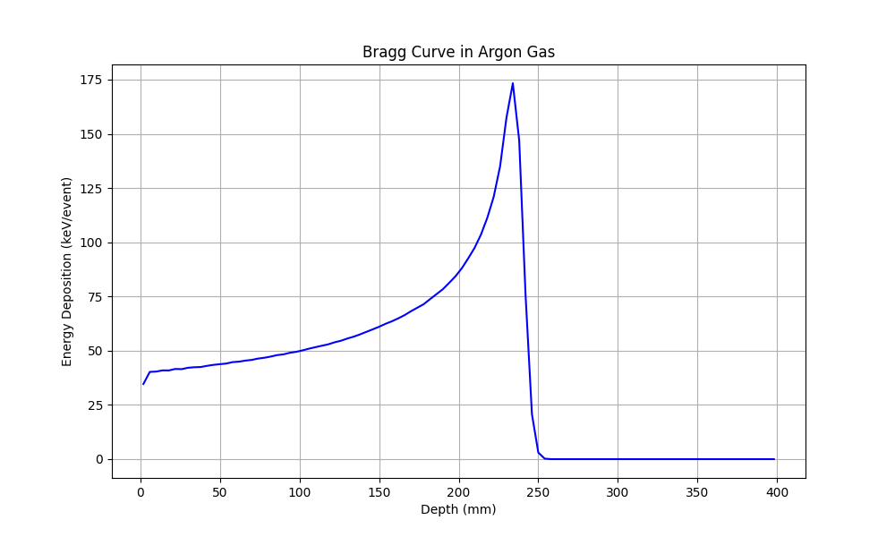

# Bragg Curve in Argon Gas

Simulation of Bragg curve (energy deposition vs depth) in Argon gas using Geant4.

## Building the Project

Ensure you have Geant4 installed and sourced.

```bash
mkdir -p build
cd build
cmake ..
make -j$(nproc)
```

## Running the Simulation

### Batch Mode
To run the simulation and output energy deposition to the terminal:
```bash
./build/bragg_curve run1.mac
```

### Interactive Mode (Visualization)
To open the GUI and visualize the experiment:
```bash
./build/bragg_curve
```
Once the session starts, run particles using:
```bash
/run/beamOn 10
```

## Results

The simulation generates the Bragg curve.



### Generating Plots
A Python script is provided to automate running the simulation and plotting the results.
```bash
python3 plot_results.py
```

## Project Structure
- `src/`, `include/`: Simulation source code (snake_case convention).
- `run1.mac`: Macro for simulation run.
- `init_vis.mac`, `vis.mac`: Visualization configuration.
- `plot_results.py`: Data analysis and plotting script.
